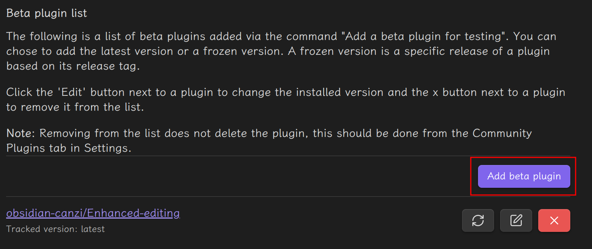

### 显示代码文件  
参考[# Hugo Shortcode 渲染外部代码和文件](https://blog.lockshell.com/posts/hugo-shortcode-render-external-file/)  
把代码从文件中读取并渲染在页面上,使用[hugo shortcode](https://gohugo.io/content-management/shortcodes)实现  
在hugo仓库根目录下新建`layouts/shortcodes/code.html`,写入:  
```  
{{- /* 获取传入的相对路径，比如 assets/Smokeping/readTitleHostFromXLSX.py */ -}}  
{{- $relPath := .Get "file" -}}  
{{- /* 代码语言，默认 text，可以传 python/js 等 */ -}}  
{{- $lang := .Get "language" | default "text" -}}  
{{- /* 当前页面所在目录，比如 content/Blog/中间件/Smokeping/ */ -}}  
{{- $pageDir := .Page.File.Dir -}}  
{{- /* 拼出实际文件路径 */ -}}  
{{- $fullPath := printf "%s%s" $pageDir $relPath -}}  
{{- /* 读文件内容 */ -}}  
{{- $content := readFile $fullPath -}}  
{{- /* 包一层 Markdown 三引号代码块，再交给 markdownify 渲染 */ -}}  
{{- (print "```" $lang "\n" $content "\n```") | markdownify -}}  
```  
然后在文章中按照下面的格式导入即可:  
```  
  
```  
### 行末添加空格  
在Obsidian中默认的回车会被渲染为换行,而在hugo中两个空格后的回车才被显示为换行  
在Obsidian的设置中可以设置严格换行,但只在源码模式中有效(切换为阅读视图时严格换行),在实时预览模式下无效  
可以安装[增强编辑](https://github.com/obsidian-canzi/Enhanced-editing)插件  
首先在第三方插件搜索[BRAT](https://github.com/TfTHacker/obsidian42-brat)插件并安装,然后在其中添加增强编辑插件(输入仓库url即可)  
