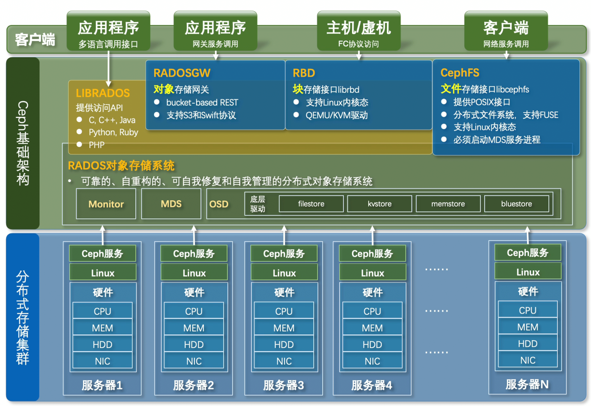
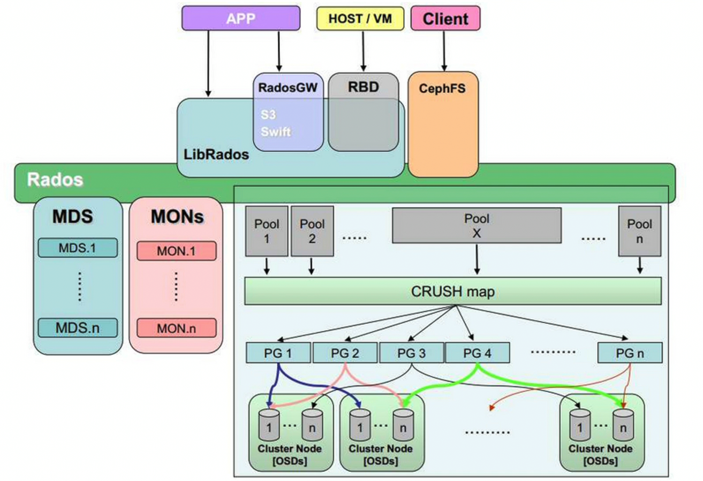
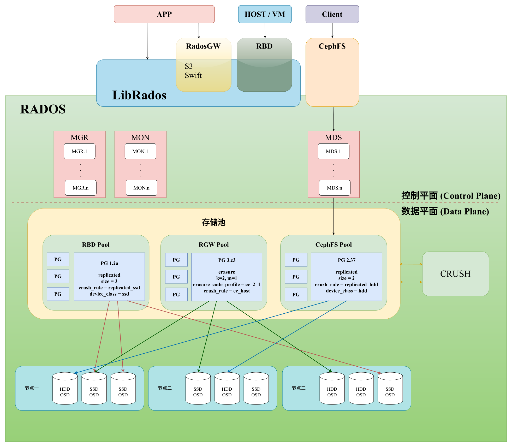

ceph是一个开源的分布式存储系统,用于构建高性能,高可扩展性,高可靠性的存储集群.常用于云计算,企业数据中心,大规模存储等场景  
## 特点  
ceph的特点:  
- 高性能  
	- 摒弃集中式存储元数据寻址方案,采用`CRUSH`算法,数据分布均衡并行度高  
	- 考虑容灾隔离,能实现各类负载副本放置规则,例如跨机房,机架感知等  
	- 支持上千存储节点的规模,支持TB到PB级数据  
- 高可扩展性  
	- 去中心化,扩展灵活,随节点增加而线性增加  
- 高可用性  
	- 副本数量可以灵活控制  
	- 支持故障分域,数据强一致性  
	- 多种故障场景自动进行修复自愈  
	- 无单点故障,自动管理  
- 接口丰富  
	- 支持块存储,文件存储,对象存储  
	- 支持自定义接口,支持多语言驱动  
## 架构  
### 存储  
#### 统一存储  
- ceph支持: 文件存储 + 块存储 + 对象存储  
- 传统存储支持: 文件存储 + 块存储  
#### 原生对象存储  
ceph将文件转换为4MB的对象集合,对象唯一标识符保存在kv数据库中,提供扁平寻址空间,提供规模扩展和性能提升可行性.  
### 三层架构  
  


#### RADOS  
ceph的核心是`RADOS`对象存储系统,它把一切数据看作对象,在这一层实现数据的复制,强一致性,不直接对用户提供服务(通过上面提到的多种方式访问).`RADOS`具有自我修复,自我管理的功能.  
`RADOS`由Monitor,MDS,OSD等系统组成.  
##### Monitor  
##### MDS  
##### OSD  
OSD具有多种底层驱动  
- filestore: 需要磁盘具有文件系统,按照文件系统的规则进行读写  
- kvstore  
- memstore  
- bluestore: 操作底层空间,不需要文件系统,速度快,支持WAL预写机制  
#### 访问接口  
ceph提供了多种方式给客户端访问:  
- `LIBRADOS`: 提供访问API,允许应用程序通过多种语言调用接口  
- `RADOSGW`: 提供RESTFUL风格的**对象存储**网关,支持应用程序通过`S3`和`Swift`协议访问,基于`LIBRADOS`  
- `RBD`: 提供**块存储**接口,同样基于`LIBRADOS`  
- `CephFS`: 提供**文件存储**接口,提供**POSIX接口**,支持**FUSE**,使用它必须启动**MDS服务进程**  
#### 硬件平台  
分布式的服务器集群通过**ceph服务**对外提供服务.  
## 核心组件  
### 池(Pool)  
Ceph 存储集群将数据对象存储在名为 **Pool（池）** 的逻辑分区中。  
Ceph 管理员可以创建用于特定类型数据的池，例如块设备、对象网关，或用于隔离不同用户组。  
从 Ceph 客户端的视角来看，池表现为一个具有访问控制的逻辑分区；但实际上，**池在 Ceph 集群的数据分布、存储策略和耐久性机制中扮演着关键角色**。  
#### 池类型(Pool Type):
池类型决定池使用的数据持久性方式，并且对客户端透明。池的数据耐久策略在整个池范围内保持统一，并在池创建后不可修改。  
池支持两种主要的数据持久方式：  
- **副本池(Replica Pools)**：使用多个深度副本，并通过 CRUSH 将其分布到不同硬件上，确保在局部硬件故障时仍能保持数据可用。  
- **纠删码池(Erasure-Coded Pools)**：纠删码池将每个对象分成 K+M 个碎片，其中 K 为数据碎片，M 为编码碎片。K+M 的总数代表存储一个对象所需的 OSD 数量，而 M 表示在最多 M 个 OSD 故障的情况下仍然能够恢复数据。  
### 放置组(Placement Groups, PG)
Ceph 将一个池切分为多个放置组（PG）。PG将对象作为一个组放入OSD。Ceph在内部以PG为粒度管理数据，这比直接管理单个RADOS对象具有更好的扩展性。
- PG 是对象与 OSD 之间的中间映射单元  
- CRUSH 算法根据对象名称计算其所属 PG，并计算该 PG 的 Acting Set（负责存储该 PG 的 OSD 集合）  
- 每个对象先映射到 PG，再由 PG 映射到多个 OSD  
管理员在创建或调整pool时设置 PG 数量（即 pool 被切成多少个 PG）  
### CRUSH
CRUSH(Controlled Replication Under Scalable Hashing 受控复制的可扩展哈希算法)是一种基于哈希的数据分布算法。以数据唯一标识符，当前存储集群的拓扑结构以及数据备份策略作为CRUSH输入，可以随时随地通过计算获取数据所在的底层存储设备位置并直接与其通信，从而避免查表操作，实现去中心化和高度并发。  
CRUSH同时支持多种数据备份策略，如镜像，RAID，纠删码等。并受控地将数据的多个备份映射到集群不同物理区域中的底层存储设备之上，从而保证数据可靠性。  
### OSD

Pool,PG,OSD的数量关系：  
- Pool中PG的数量由ceph管理员设定(pg_num)  
- 每个PG包含的OSD数量有Pool的副本数或纠删码决定  
- 每个OSD承载的PG数量由CRUSH自动均衡((Pool 的 PG 数量 × 副本数) / OSD 总数)

## 部署
### 准备工作
Ceph集群上的主机都需要满足以下要求：
- Python3
- Systemd
- Podman or Docker 来运行容器
- 时间同步(Chrony或者ntpd)
- LVM2 配置存储设备
#### 配置软件源
安装阿里云`epel`和`docker-ce`软件源
```
curl -o /etc/yum.repos.d/docker-ce.repo http://mirrors.aliyun.com/docker-ce/linux/centos/docker-ce.repo
curl -o /etc/yum.repos.d/epel-7.repo  http://mirrors.aliyun.com/repo/epel-7.repo

yum clean all 
yum makecache
```
#### 关闭防火墙和SELinux
```
systemctl disable --now firewalld

vim /etc/selinux/config
SELINUX=disabled

reboot
```
#### 设置服务器名
```
hostnamectl set-hostname ceph1
hostnamectl set-hostname ceph2
hostnamectl set-hostname ceph3
```
#### 安装chrony
安装chrony进行时间同步
```
yum install chrony -y

# 服务端配置
vim /etc/chrony.conf

pool ntp.aliyun.com iburst
driftfile /var/lib/chrony/drift
makestep 1.0 3
rtcsync
allow 192.168.1.0/24
local stratum 10
keyfile /etc/chrony.keys
logdir /var/log/chrony
leapsectz right/UTC

# 客户端配置
vim /etc/chrony.conf

pool 192.168.1.2 iburst # 这里是服务端IP
driftfile /var/lib/chrony/drift
makestep 1.0 3
rtcsync
keyfile /etc/chrony.keys
logdir /var/log/chrony
leapsectz right/UTC
```
安装后使用`chronyc sources -v`在客户端进行验证。  
#### 安装python3
安装编译用到的软件和openssl 1.1.1(自带的openssl 1.0太旧，python需要至少openssl 1.1.1)
```
yum groupinstall "Development Tools"
yum install bzip2-devel libffi-devel zlib-devel
#需要EPEL仓库
#安装openssl11，后期的pip3安装网络相关模块需要用到ssl模块。
yum install -y openssl11 openssl11-devel
```
进入刚解压缩的目录
```
cd /root/Python-3.11.0
```
在编译之前需要确保python的`configure`脚本能够找到正确的ssl头文件和lib文件位置  
在Centos上安装`openssl`和`openssl11-devel`软件包之后，相关文件位于：  
```
$ whereis openssl11
openssl11: /usr/bin/openssl11 /usr/lib64/openssl11 /usr/include/openssl11 /usr/share/man/man1/openssl11.1.gz

#此目录下存在ssl.h头文件
$ ls /usr/include/openssl11/
openssl

# 此目录下存在lib文件
$ ls /usr/lib64/openssl11/
libcrypto.so  libssl.so
# 实际上该目录中的文件是指向/usr/lib64目录下头文件的软链接
$ ll /usr/lib64/openssl11/
total 0
lrwxrwxrwx. 1 root root 22 Dec 15 14:05 libcrypto.so -> ../libcrypto.so.1.1.1k
lrwxrwxrwx. 1 root root 19 Dec 15 14:05 libssl.so -> ../libssl.so.1.1.1k
```
查看`configure`脚本可以看到，这两个目录的位置是无法被脚本找到的：
```
            if test x"$PKG_CONFIG" != x""; then
                OPENSSL_LDFLAGS=`$PKG_CONFIG openssl --libs-only-L 2>/dev/null`
                if test $? = 0; then
                    OPENSSL_LIBS=`$PKG_CONFIG openssl --libs-only-l 2>/dev/null`
                    OPENSSL_INCLUDES=`$PKG_CONFIG openssl --cflags-only-I 2>/dev/null`
                    found=true
                fi
            fi

            # no such luck; use some default ssldirs
            if ! $found; then
                ssldirs="/usr/local/ssl /usr/lib/ssl /usr/ssl /usr/pkg /usr/local /usr"
            fi


fi
    # note that we #include <openssl/foo.h>, so the OpenSSL headers have to be in
    # an 'openssl' subdirectory

    if ! $found; then
        OPENSSL_INCLUDES=
        for ssldir in $ssldirs; do
            { $as_echo "$as_me:${as_lineno-$LINENO}: checking for openssl/ssl.h in $ssldir" >&5
$as_echo_n "checking for openssl/ssl.h in $ssldir... " >&6; }
            if test -f "$ssldir/include/openssl/ssl.h"; then
                OPENSSL_INCLUDES="-I$ssldir/include"
                OPENSSL_LDFLAGS="-L$ssldir/lib"
                OPENSSL_LIBS="-lssl -lcrypto"
                found=true
                { $as_echo "$as_me:${as_lineno-$LINENO}: result: yes" >&5
$as_echo "yes" >&6; }
                break
            else
                { $as_echo "$as_me:${as_lineno-$LINENO}: result: no" >&5
$as_echo "no" >&6; }
            fi
        done
```
脚本首先会查看`PKG_CONFIG`环境变量，如果不存在，则在预定义的几个目录中查找，我们的`/usr`目录虽然也在预定义的目录中，但是其查找的是`/usr/include/openssl/ssl.h`，而我们的文件在`/usr/include/openssl11/openssl/ssl.h`。同理，脚本查找的lib文件在`/usr/lib`目录下，而我们的文件在`/usr/lib64`(存在软链接在`/usr/lib64/openssl/`)。  
可以创建软链接来解决：
```
$ ln -s /usr/include/openssl11/openssl/ /usr/include/openssl
$ ln -s /usr/lib64/openssl11/libcrypto.so /usr/lib/libcrypto.so
$ ln -s /usr/lib64/openssl11/libssl.so /usr/lib/libssl.so
```
开始编译:
```
./configure --prefix=/usr/python --with-openssl=/usr
#指定python3的安装目录为/usr/python并编译ssl模块，指定目录好处是后期删除此文件夹就可以完全删除软件了
make -j $(nproc)
```
测试`ssl`是否编译成功：
```
$ ./python -c "import ssl; print(ssl.OPENSSL_VERSION)"
OpenSSL 1.1.1k  FIPS 25 Mar 2021
```
安装：
```
make install
#源码编译并安装
ln -s /usr/python/bin/python3 /usr/bin/python3
ln -s /usr/python/bin/pip3 /usr/bin/pip3
```
#### 安装docker
```
yum install -y yum-utils device-mapper-persistent-data lvm2

# 需要docker-ce软件仓库
yum install -y docker-ce-24.0.7-1.el7 docker-ce-cli-24.0.7-1.el7 containerd.io
```
配置Docker的"live restore"，即允许在不重新启动所有正在运行的容器的情况下重新启动 Docker 引擎  
```
vim /etc/docker/daemon.json
{
  "live-restore": true
}

systemctl restart docker
```
### 安装 CEPHADM
以下内容在服务端上操作：  
安装 CEPHADM，注意从[releases页面](https://docs.ceph.com/en/latest/releases/#active-releases)查看想要安装版本的最新版本，例如我想要安装的是Octopus版本，那么版本号就是15.2.17:  
```
CEPH_RELEASE=15.2.17

curl --silent --remote-name --location https://download.ceph.com/rpm-18.2.0/el9/noarch/cephadm
```
然而上面的链接似乎已经失效了，下载下来的是一个404错误消息，可以手动访问ceph仓库，切换到该版本的分支并前往`ceph/src/cephadm/cephadm`查看文件内容，将链接中的`blob`换成`raw`即可通过网络下载：
```
curl --silent --remote-name --location https://github.com/ceph/ceph/raw/octopus/src/cephadm/cephadm
```
下载之后可以发现`cephadm`实际上是一个python脚本。  
```
# 给予运行权限
chmod +x cephadm

# 添加一个yum存储库，这里需要指定的是版本名称，而不是版本号
./cephadm add-repo --release octopus

# 安装cephadm命令的软件包
./cephadm install

# 确认命令是否成功安装
$ which cephadm
/usr/sbin/cephadm
```
### 创建集群
首先需要确保：
1. 主机名不能太长，例如`localhost.localdomain`就太长
2. 主机上存在主机名的DNS解析
3. SSH端口是默认的`22`，否则需要手动传入SSH配置文件
4. 需要一个集群内部其他机器可访问的IP地址

```
# 修改主机名
hostnamectl set-hostname ceph1

# 添加主机名的DNS解析
vim /etc/hosts

127.0.0.1   localhost ceph1
::1         localhost ceph1
192.168.1.2 localhost ceph1

# 创建一个SSH的配置文件
vim ssh_config

Host *
  Port 5678
  User root
  StrictHostKeyChecking no
```
然后通过`cephadm`命令创建一个集群：  
```
# 这里使用和其他Ceph机器同处的局域网IP即可
cephadm bootstrap --mon-ip 192.168.1.2 --ssh-config ./ssh_config
```
然后需要安装`ceph`命令，[官方文档](https://docs.ceph.com/en/latest/cephadm/install/#enable-ceph-cli)有几种方法：
- `cephadm shell`
- `cephadm shell -- ceph -s`
- `cephadm install ceph-common`

我这里选择第三种
```
# 官方源下载太慢，这里换成清华源
sed -i 's_download.ceph.com_mirrors.tuna.tsinghua.edu.cn/ceph_g' /etc/yum.repos.d/ceph.repo 

# 安装ceph-common软件包
cephadm install ceph-common
```
然后就可以使用`ceph`命令
```
# 查看集群状态
ceph status
  cluster:
    id:     59f56c2c-dafa-11f0-a750-68a8297ec412
    health: HEALTH_WARN    # 这里有一个warn很正常，是由于还没有添加OSD
            OSD count 0 < osd_pool_default_size 3
 
  services:
    mon: 1 daemons, quorum ceph1 (age 3h)
    mgr: ceph1.zxojlm(active, since 3h)
    osd: 0 osds: 0 up, 0 in
 
  data:
    pools:   0 pools, 0 pgs
    objects: 0 objects, 0 B
    usage:   0 B used, 0 B / 0 B avail
    pgs:     
```
### 添加主机
首先需要把集群的公共SSH密钥添加到新主机root用户的`authorized_keys`文件：
```
ssh-copy-id -f -i /etc/ceph/ceph.pub root@192.168.1.3
ssh-copy-id -f -i /etc/ceph/ceph.pub root@192.168.1.4
```
然后告诉Ceph新节点是集群的一部分：
```
# 命令是: ceph orch host add *<newhost>* [*<ip>*] [*<label1> ...*]，其中 newhost 必须是主机的hostname
ceph orch host add ceph2 192.168.1.3 --labels _admin

# 也可以先添加主机，后添加标签
ceph orch host add ceph3 192.168.1.4 
ceph orch host label add ceph3 _admin
```
> 默认情况下，`ceph.conf`和`ceph.client.admin.keyring`密钥环只在具有`_admin`标签的主机上存在，最好为多个主机提供`_admin`标签(创建集群的主机默认具有该权限)，以便 Ceph Cli 能够在多个主机上访问，否则一旦该主机故障，其他主机需要先复制下来这些文件才能访问 Ceph Cli。

查看当前集群的状态：
```
ceph orch host ls
HOST   ADDR         LABELS  STATUS  
ceph1  ceph1                        
ceph2  192.168.1.3  _admin          
ceph3  192.168.1.4  _admin          
```
状态没有显示，可能是已经`online`了，可以查看运行的容器，观察有没有运行在新的主机上：
```
ceph orch ps
ceph orch ps
NAME                 HOST   STATUS         REFRESHED  AGE  VERSION  IMAGE NAME                                IMAGE ID      CONTAINER ID  
alertmanager.ceph1   ceph1  running (39m)  2m ago     4h   0.20.0   quay.io/prometheus/alertmanager:v0.20.0   0881eb8f169f  84a620ebf962  
crash.ceph1          ceph1  running (4h)   2m ago     4h   15.2.17  quay.io/ceph/ceph:v15                     93146564743f  8a574d091104  
crash.ceph2          ceph2  running (39m)  2m ago     39m  15.2.17  quay.io/ceph/ceph:v15                     93146564743f  ab182ee00a2f  
crash.ceph3          ceph3  running (3m)   2m ago     3m   15.2.17  quay.io/ceph/ceph:v15                     93146564743f  f6e9ab35a36e  
```
默认集群中只有一个`Mon`，如果集群里的所有主机都在同一个子网，`cephadm`会自动管理Mon的数量，通常建议值是三到五个Mon，他们会自动分散到不同的主机上，可以手动干预指定Mon放置的主机：
```
ceph orch apply mon --placement="ceph1,ceph2,ceph3"
```
### 添加OSD
Ceph上使用的磁盘必须满足以下条件：
1. 没有分区
2. 不具有任何LVM状态
3. 没有被挂载
4. 不包含文件系统
5. 不包含Ceph BlueStore OSD
6. 空间大于5GB

列出所有节点上可用的磁盘：
```
ceph orch device ls
```
可以手动指定设备：
```
ceph orch daemon add osd ceph1:/dev/sdb
```
也可以直接消耗所有可用的设备：
```
ceph orch apply osd --all-available-devices
```
> 不要尝试手动指定设备和消耗所有设备同时使用，这会导致ceph集群陷入幽灵状态，即显示OSD存在但一直处于`down`状态。

## 参考
- [# Red Hat Ceph Storage 架构指南](https://docs.redhat.com/zh-cn/documentation/red_hat_ceph_storage/8/html/architecture_guide/index)
- [](https://www.wuzao.com/ceph/en/latest/cephadm/install/index.html#cephadm-install-curl)
- [](https://www.cnblogs.com/Pigs-Will-Fly/p/18671388#_label3_0)
- [](https://docs.ceph.com/en/latest/cephadm/)
- [](https://www.yuque.com/xianzhou-eiffx/aklhoc/vz2kwrequbkhoxhv)
